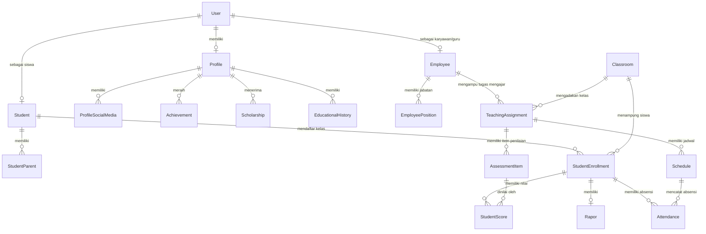

# Arsitektur & Skema Database SIAKAD

Dokumen ini menjelaskan arsitektur basis data, struktur tabel, detail kolom/row, dan hubungan antar-entitas dalam sistem informasi akademik (SIAKAD). Database ini menggunakan **PostgreSQL** dan dikelola secara modular menggunakan **Prisma ORM** (Prisma 5.15+ Multi-File Schema).

---

## 🛠️ Arsitektur Prisma Multi-File

Proyek ini tidak menggunakan satu file `schema.prisma` raksasa. Sebagai gantinya, skema database dipecah menjadi beberapa berkas `.prisma` terpisah di dalam direktori `prisma/` untuk menjaga keterbacaan dan modularitas.

*   **`schema.prisma`**: Berisi konfigurasi dasar generator (`prisma-client-js`) dan datasource (`postgresql`).
*   **`[domain].prisma`**: Berisi definisi tabel/model yang dikelompokkan berdasarkan area bisnis.
*   **Kompilasi Skema**: Berkat konfigurasi `schema: 'prisma'` pada `prisma.config.ts`, mesin Prisma secara otomatis memindai dan menggabungkan seluruh berkas `.prisma` di direktori tersebut menjadi satu kesatuan skema saat melakukan migrasi (`prisma migrate dev`) atau pembuatan client (`prisma generate`).

---

## 📊 Diagram Hubungan Entitas (ERD Konseptual)

Berikut adalah visualisasi hubungan tingkat tinggi antara entitas utama dalam database SIAKAD:

---

## 🗂️ Kamus Data Lengkap (Model & Detail Kolom)

Berikut adalah seluruh daftar tabel (model) beserta definisi kolom, tipe data, hubungan, dan atributnya secara mendetail.

### 1. Modul Autentikasi & Sesi (`auth.prisma`)

#### Model `User` (`users`)
Menyimpan data kredensial login utama dan peran pengguna.

| Nama Kolom | Tipe Data (Prisma) | Tipe Data (DB) | Atribut / Hubungan | Keterangan |
| :--- | :--- | :--- | :--- | :--- |
| `id` | `String` | `Uuid` | `@id`, `@default(uuid())` | Primary Key |
| `username` | `String` | `VarChar(50)` | `@unique` | Username login unik |
| `password` | `String` | `VarChar(255)` | - | Hash password bcrypt |
| `role` | `Role` (Enum) | `role` | `@default(STUDENT)` | Peran: `ADMIN`, `EMPLOYEE`, `STUDENT` |
| `isActive` | `Boolean` | `boolean` | `@default(true)`, `@map("is_active")` | Status aktif akun |
| `createdAt` | `DateTime` | `timestamp` | `@default(now())`, `@map("created_at")` | Waktu akun dibuat |
| `updatedAt` | `DateTime` | `timestamp` | `@updatedAt`, `@map("updated_at")` | Waktu akun diubah |
| `deletedAt` | `DateTime?` | `timestamp` | `@map("deleted_at")` | Soft delete marker |

*   **Relasi**:
    *   `employee`: `Employee?` (1:1 ke tabel `employees`)
    *   `profile`: `Profile?` (1:1 ke tabel `profiles`)
    *   `student`: `Student?` (1:1 ke tabel `students`)
    *   `sessions`: `AuthSession[]` (1:N ke tabel `auth_sessions`)

#### Model `AuthSession` (`auth_sessions`)
Menyimpan data sesi login aktif untuk autentikasi token JWT.

| Nama Kolom | Tipe Data (Prisma) | Tipe Data (DB) | Atribut / Hubungan | Keterangan |
| :--- | :--- | :--- | :--- | :--- |
| `id` | `String` | `Uuid` | `@id`, `@default(uuid())` | Primary Key |
| `userId` | `String` | `Uuid` | `@map("user_id")`, `@@index` | Foreign Key ke `User` |
| `tokenHash` | `String` | `VarChar(255)` | `@map("token_hash")`, `@@index` | Hash dari refresh token |
| `userAgent` | `String?` | `VarChar(512)` | `@map("user_agent")` | Info browser/perangkat |
| `ipAddress` | `String?` | `VarChar(64)` | `@map("ip_address")` | Alamat IP pengguna |
| `expiresAt` | `DateTime` | `timestamp` | `@map("expires_at")`, `@@index` | Waktu sesi kedaluwarsa |
| `lastUsedAt` | `DateTime` | `timestamp` | `@default(now())`, `@map("last_used_at")` | Penggunaan terakhir |
| `revokedAt` | `DateTime?` | `timestamp` | `@map("revoked_at")` | Waktu pencabutan sesi |
| `createdAt` | `DateTime` | `timestamp` | `@default(now())`, `@map("created_at")` | Sesi dibuat |
| `updatedAt` | `DateTime` | `timestamp` | `@updatedAt`, `@map("updated_at")` | Sesi diubah |

---

### 2. Modul Profil Pribadi & Riwayat (`profile.prisma`, `profile-extras.prisma`)

#### Model `Profile` (`profiles`)
Menyimpan informasi identitas pribadi dasar pengguna.

| Nama Kolom | Tipe Data (Prisma) | Tipe Data (DB) | Atribut / Hubungan | Keterangan |
| :--- | :--- | :--- | :--- | :--- |
| `id` | `String` | `Uuid` | `@id`, `@default(uuid())` | Primary Key |
| `userId` | `String` | `Uuid` | `@unique`, `@map("user_id")` | Foreign Key 1:1 ke `User` |
| `name` | `String` | `VarChar(100)` | - | Nama Lengkap |
| `nik` | `String` | `VarChar(16)` | `@unique` | Nomor Induk Kependudukan |
| `gender` | `UserGender` | `user_gender` | - | Jenis Kelamin: `MALE`, `FEMALE` |
| `birthPlace` | `String` | `VarChar(100)` | `@map("birth_place")` | Tempat Lahir |
| `birthDate` | `DateTime` | `date` | `@map("birth_date")` | Tanggal Lahir (Format tanggal saja) |
| `email` | `String?` | `VarChar(255)` | `@unique` | Alamat Email |
| `phone` | `String?` | `VarChar(15)` | `@unique` | Nomor Telepon |
| `religion` | `Religion?` | `religion` | - | Agama (Enum: `ISLAM`, `HINDU`, dll) |
| `bloodType` | `BloodType?` | `blood_type` | `@map("blood_type")` | Golongan Darah (Enum: `A`, `O`, dll) |
| `maritalStatus` | `MaritalStatus?`| `marital_status` | `@map("marital_status")`| Status Nikah (Enum: `SINGLE`, dll) |
| `noKk` | `String?` | `VarChar(16)` | `@map("no_kk")` | Nomor Kartu Keluarga |
| `npwp` | `String?` | `VarChar(20)` | - | NPWP |

*   **Relasi**:
    *   `user`: `User` (Relasi balik ke `User`)
    *   `socialMedias`: `ProfileSocialMedia[]` (1:N ke media sosial)
    *   `achievements`: `Achievement[]` (1:N ke prestasi)
    *   `scholarships`: `Scholarship[]` (1:N ke beasiswa)
    *   `educationalHistories`: `EducationalHistory[]` (1:N ke riwayat pendidikan)

#### Model `Achievement` (`achievements`)
Mencatat daftar prestasi yang diraih oleh profil pengguna.

| Nama Kolom | Tipe Data (Prisma) | Tipe Data (DB) | Atribut / Hubungan | Keterangan |
| :--- | :--- | :--- | :--- | :--- |
| `id` | `String` | `Uuid` | `@id`, `@default(uuid())` | Primary Key |
| `profileId` | `String` | `Uuid` | `@map("profile_id")` | Foreign Key ke `Profile` |
| `name` | `String` | `VarChar(200)` | - | Nama Prestasi |
| `level` | `String` | `VarChar(100)` | - | Tingkat Kejuaraan |
| `type` | `AchievementType` | `achievement_type` | - | Enum: `DISTRICT`, `CITY`, `PROVINCE`, `NATIONAL`, `INTERNATIONAL` |
| `year` | `Int` | `integer` | - | Tahun Perolehan |
| `description`| `String?` | `text` | - | Deskripsi Singkat |
| `deletedAt` | `DateTime?` | `timestamp` | `@map("deleted_at")` | Soft delete |

#### Model `Scholarship` (`scholarships`)
Mencatat riwayat beasiswa yang diterima oleh profil pengguna.

| Nama Kolom | Tipe Data (Prisma) | Tipe Data (DB) | Atribut / Hubungan | Keterangan |
| :--- | :--- | :--- | :--- | :--- |
| `id` | `String` | `Uuid` | `@id`, `@default(uuid())` | Primary Key |
| `profileId` | `String` | `Uuid` | `@map("profile_id")` | Foreign Key ke `Profile` |
| `name` | `String` | `VarChar(200)` | - | Nama Beasiswa |
| `provider` | `String` | `VarChar(200)` | - | Instansi Pemberi Beasiswa |
| `year` | `Int` | `integer` | - | Tahun Beasiswa |
| `status` | `ScholarshipStatus`| `scholarship_status`| `@default(ACTIVE)` | Enum: `ACTIVE`, `COMPLETED`, `REVOKED` |
| `deletedAt` | `DateTime?` | `timestamp` | `@map("deleted_at")` | Soft delete |

#### Model `EducationalHistory` (`educational_histories`)
Mencatat riwayat pendidikan formal sebelum/selain institusi saat ini.

| Nama Kolom | Tipe Data (Prisma) | Tipe Data (DB) | Atribut / Hubungan | Keterangan |
| :--- | :--- | :--- | :--- | :--- |
| `id` | `String` | `Uuid` | `@id`, `@default(uuid())` | Primary Key |
| `profileId` | `String` | `Uuid` | `@map("profile_id")` | Foreign Key ke `Profile` |
| `level` | `String` | `VarChar(50)` | - | Jenjang Pendidikan (SD, SMP, dll) |
| `institution`| `String` | `VarChar(200)` | - | Nama Sekolah / Universitas |
| `major` | `String?` | `VarChar(100)` | - | Jurusan (jika ada) |
| `startYear` | `Int` | `integer` | `@map("start_year")` | Tahun Masuk |
| `endYear` | `Int?` | `integer` | `@map("end_year")` | Tahun Lulus |
| `status` | `EducationStatus` | `education_status` | `@default(ACTIVE)` | Enum: `GRADUATED`, `ACTIVE`, `TRANSFERRED`, `DROPPED` |
| `deletedAt` | `DateTime?` | `timestamp` | `@map("deleted_at")` | Soft delete |

---

### 3. Modul Siswa & Orang Tua (`student.prisma`, `parent.prisma`, `enrollment.prisma`)

#### Model `Student` (`students`)
Menyimpan identitas akademik spesifik siswa.

| Nama Kolom | Tipe Data (Prisma) | Tipe Data (DB) | Atribut / Hubungan | Keterangan |
| :--- | :--- | :--- | :--- | :--- |
| `id` | `String` | `Uuid` | `@id`, `@default(uuid())` | Primary Key |
| `userId` | `String` | `Uuid` | `@unique`, `@map("user_id")` | Foreign Key 1:1 ke `User` |
| `nis` | `String` | `VarChar(20)` | `@unique` | Nomor Induk Siswa (Sekolah) |
| `nisn` | `String` | `VarChar(20)` | `@unique` | Nomor Induk Siswa Nasional |
| `status` | `StudentStatus` | `student_status` | `@default(ACTIVE)`, `@@index` | Enum: `ACTIVE`, `TRANSFERRED`, `DROPPED`, `GRADUATED` |
| `classroomLevelId`| `String?` | `Uuid` | `@map("classroom_level_id")`, `@@index` | Foreign Key ke `ClassroomLevel` |
| `deletedAt` | `DateTime?` | `timestamp` | `@map("deleted_at")` | Soft delete |

*   **Relasi**:
    *   `user`: `User` (Relasi balik ke `User`)
    *   `classroomLevel`: `ClassroomLevel?` (Relasi ke tingkatan kelas)
    *   `addresses`: `Address[]` (1:N ke alamat tinggal)
    *   `parents`: `StudentParent[]` (1:N ke data orang tua/wali)
    *   `enrollments`: `StudentEnrollment[]` (1:N ke riwayat kelas siswa)
    *   `graduations`: `StudentGraduation[]` (1:N ke riwayat kelulusan)
    *   `classroomPresidencies`, `classroomVicePresidencies`, `classroomSecretaryRoles`, `classroomTreasurerRoles`: Hubungan kepengurusan kelas ke `ClassroomStructure`.

#### Model `Parent` (`parents`)
Menyimpan data identitas orang tua atau wali dari siswa.

| Nama Kolom | Tipe Data (Prisma) | Tipe Data (DB) | Atribut / Hubungan | Keterangan |
| :--- | :--- | :--- | :--- | :--- |
| `id` | `String` | `Uuid` | `@id`, `@default(uuid())` | Primary Key |
| `name` | `String` | `VarChar(100)` | - | Nama Lengkap Orang Tua/Wali |
| `nik` | `String` | `VarChar(16)` | `@unique` | NIK |
| `birthPlace` | `String` | `VarChar(100)` | `@map("birth_place")` | Tempat Lahir |
| `birthDate` | `DateTime` | `date` | `@map("birth_date")` | Tanggal Lahir |
| `email` | `String?` | `VarChar(255)` | - | Email |
| `phone` | `String?` | `VarChar(15)` | - | Nomor Telepon |
| `occupationId`| `String` | `Uuid` | `@map("occupation_id")` | Foreign Key ke `Occupation` |
| `educationId` | `String?` | `Uuid` | `@map("education_id")` | Foreign Key ke `Education` |
| `income` | `IncomeRange?` | `income_range` | `@map("income")` | Penghasilan bulanan (Enum: `BELOW_500K`, dll) |
| `deletedAt` | `DateTime?` | `timestamp` | `@map("deleted_at")` | Soft delete |

*   **Relasi**:
    *   `occupation`: `Occupation` (Referensi pekerjaan)
    *   `education`: `Education?` (Referensi pendidikan terakhir)
    *   `addresses`: `Address[]` (1:N ke alamat)
    *   `studentParents`: `StudentParent[]` (1:N ke tabel penghubung anak)

#### Model `StudentParent` (`student_parents`)
Tabel penghubung Many-to-Many antara `Student` dan `Parent`.

| Nama Kolom | Tipe Data (Prisma) | Tipe Data (DB) | Atribut / Hubungan | Keterangan |
| :--- | :--- | :--- | :--- | :--- |
| `id` | `String` | `Uuid` | `@id`, `@default(uuid())` | Primary Key |
| `studentId` | `String` | `Uuid` | `@map("student_id")`, `@@unique` | Foreign Key ke `Student` |
| `parentId` | `String` | `Uuid` | `@map("parent_id")`, `@@unique` | Foreign Key ke `Parent` |
| `relation` | `ParentRelation`| `parent_relation`| - | Hubungan: `FATHER`, `MOTHER`, `GUARDIAN` |
| `isPrimary` | `Boolean` | `boolean` | `@default(false)`, `@map("is_primary")` | Apakah wali utama? |
| `deletedAt` | `DateTime?` | `timestamp` | `@map("deleted_at")` | Soft delete |

#### Model `StudentEnrollment` (`student_enrollments`)
Mencatat pendaftaran masuk kelas siswa pada semester tertentu.

| Nama Kolom | Tipe Data (Prisma) | Tipe Data (DB) | Atribut / Hubungan | Keterangan |
| :--- | :--- | :--- | :--- | :--- |
| `id` | `String` | `Uuid` | `@id`, `@default(uuid())` | Primary Key |
| `studentId` | `String` | `Uuid` | `@map("student_id")`, `@@unique` | Foreign Key ke `Student` |
| `classroomId` | `String` | `Uuid` | `@map("classroom_id")`, `@@index` | Foreign Key ke `Classroom` |
| `semesterId` | `String` | `Uuid` | `@map("semester_id")`, `@@unique`, `@@index` | Foreign Key ke `Semester` |
| `status` | `EnrollmentStatus`| `enrollment_status`| `@default(ACTIVE)`, `@@index`| Enum: `ACTIVE`, `PROMOTED`, `REPEATED`, `TRANSFERRED`, `DROPPED`, `GRADUATED` |
| `enrolledAt` | `DateTime` | `timestamp` | `@default(now())`, `@map("enrolled_at")` | Tanggal masuk kelas |
| `endedAt` | `DateTime?` | `timestamp` | `@map("ended_at")` | Tanggal keluar kelas |
| `note` | `String?` | `text` | - | Catatan kelas |
| `deletedAt` | `DateTime?` | `timestamp` | `@map("deleted_at")` | Soft delete |

---

### 4. Modul Staf, Guru & Pengajaran (`employee.prisma`, `position.prisma`, `subject.prisma`, `teaching.prisma`)

#### Model `Employee` (`employees`)
Menyimpan data identitas kepegawaian staf dan guru.

| Nama Kolom | Tipe Data (Prisma) | Tipe Data (DB) | Atribut / Hubungan | Keterangan |
| :--- | :--- | :--- | :--- | :--- |
| `id` | `String` | `Uuid` | `@id`, `@default(uuid())` | Primary Key |
| `userId` | `String` | `Uuid` | `@unique`, `@map("user_id")` | Foreign Key 1:1 ke `User` |
| `nip` | `String?` | `VarChar(20)` | `@unique` | Nomor Induk Pegawai |
| `nuptk` | `String?` | `VarChar(20)` | `@unique` | NUPTK |
| `employmentStatus`| `EmploymentStatus`| `employment_status`| `@map("employment_status")`| Status: `PNS`, `PPPK`, `NON_ASN` |
| `deletedAt` | `DateTime?` | `timestamp` | `@map("deleted_at")` | Soft delete |

*   **Relasi**:
    *   `addresses`: `Address[]` (1:N ke alamat)
    *   `classroomSupervisors`: `ClassroomSupervisor[]` (1:N tugas Wali Kelas)
    *   `employeePositions`: `EmployeePosition[]` (1:N riwayat jabatan)
    *   `teachingAssignments`: `TeachingAssignment[]` (1:N penugasan mengajar)

#### Model `Position` (`positions`)
Daftar master jabatan struktural/fungsional di sekolah.

| Nama Kolom | Tipe Data (Prisma) | Tipe Data (DB) | Atribut / Hubungan | Keterangan |
| :--- | :--- | :--- | :--- | :--- |
| `id` | `String` | `Uuid` | `@id`, `@default(uuid())` | Primary Key |
| `name` | `String` | `VarChar(100)` | `@unique` | Nama Jabatan (misal: Kepala Sekolah) |
| `category` | `PositionCategory`| `position_category`| - | Kategori: `MANAGEMENT`, `FINANCE`, `ADMIN`, `ACADEMIC` |
| `isActive` | `Boolean` | `boolean` | `@default(true)`, `@map("is_active")` | Status aktif jabatan |
| `deletedAt` | `DateTime?` | `timestamp` | `@map("deleted_at")` | Soft delete |

#### Model `EmployeePosition` (`employee_positions`)
Tabel penghubung penugasan jabatan untuk karyawan.

| Nama Kolom | Tipe Data (Prisma) | Tipe Data (DB) | Atribut / Hubungan | Keterangan |
| :--- | :--- | :--- | :--- | :--- |
| `id` | `String` | `Uuid` | `@id`, `@default(uuid())` | Primary Key |
| `employeeId` | `String` | `Uuid` | `@map("employee_id")`, `@@unique` | Foreign Key ke `Employee` |
| `positionId` | `String` | `Uuid` | `@map("position_id")`, `@@unique` | Foreign Key ke `Position` |
| `hireDate` | `DateTime` | `date` | `@map("hire_date")`, `@@unique` | Tanggal pengangkatan |
| `isPrimary` | `Boolean` | `boolean` | `@default(false)`, `@map("is_primary")` | Apakah jabatan utama? |
| `deletedAt` | `DateTime?` | `timestamp` | `@map("deleted_at")` | Soft delete |

#### Model `Subject` (`subjects`)
Daftar master mata pelajaran.

| Nama Kolom | Tipe Data (Prisma) | Tipe Data (DB) | Atribut / Hubungan | Keterangan |
| :--- | :--- | :--- | :--- | :--- |
| `id` | `String` | `Uuid` | `@id`, `@default(uuid())` | Primary Key |
| `code` | `String?` | `VarChar(20)` | `@unique` | Kode Mata Pelajaran (misal: MTK) |
| `name` | `String` | `VarChar(100)` | `@unique` | Nama Mata Pelajaran |
| `deletedAt` | `DateTime?` | `timestamp` | `@map("deleted_at")` | Soft delete |

#### Model `CurriculumSubject` (`curriculum_subjects`)
Menentukan mata pelajaran yang masuk dalam kurikulum per tingkatan kelas.

| Nama Kolom | Tipe Data (Prisma) | Tipe Data (DB) | Atribut / Hubungan | Keterangan |
| :--- | :--- | :--- | :--- | :--- |
| `id` | `String` | `Uuid` | `@id`, `@default(uuid())` | Primary Key |
| `curriculumId` | `String` | `Uuid` | `@map("curriculum_id")`, `@@unique`, `@@index` | Foreign Key ke `Curriculum` |
| `classroomLevelId`| `String` | `Uuid` | `@map("classroom_level_id")`, `@@unique`, `@@index`| Foreign Key ke `ClassroomLevel` |
| `subjectId` | `String` | `Uuid` | `@map("subject_id")`, `@@unique`, `@@index` | Foreign Key ke `Subject` |
| `hoursPerWeek` | `Int` | `integer` | `@default(2)`, `@map("hours_per_week")` | Beban jam per minggu |
| `deletedAt` | `DateTime?` | `timestamp` | `@map("deleted_at")` | Soft delete |

#### Model `TeachingAssignment` (`teaching_assignments`)
Penugasan guru mengampu mata pelajaran di kelas pada semester tertentu.

| Nama Kolom | Tipe Data (Prisma) | Tipe Data (DB) | Atribut / Hubungan | Keterangan |
| :--- | :--- | :--- | :--- | :--- |
| `id` | `String` | `Uuid` | `@id`, `@default(uuid())` | Primary Key |
| `employeeId` | `String` | `Uuid` | `@map("employee_id")`, `@@unique`, `@@index` | Foreign Key ke `Employee` (Guru) |
| `classroomId` | `String` | `Uuid` | `@map("classroom_id")`, `@@unique`, `@@index` | Foreign Key ke `Classroom` (Kelas) |
| `subjectId` | `String` | `Uuid` | `@map("subject_id")`, `@@unique`, `@@index` | Foreign Key ke `Subject` (Mapel) |
| `semesterId` | `String` | `Uuid` | `@map("semester_id")`, `@@unique`, `@@index` | Foreign Key ke `Semester` |
| `deletedAt` | `DateTime?` | `timestamp` | `@map("deleted_at")` | Soft delete |

*   **Relasi**:
    *   `schedules`: `Schedule[]` (1:N ke jadwal mingguan)
    *   `assessmentItems`: `AssessmentItem[]` (1:N ke item penilaian guru)

#### Model `TimeSlot` (`time_slots`)
Master alokasi jam pelajaran harian sekolah.

| Nama Kolom | Tipe Data (Prisma) | Tipe Data (DB) | Atribut / Hubungan | Keterangan |
| :--- | :--- | :--- | :--- | :--- |
| `id` | `String` | `Uuid` | `@id`, `@default(uuid())` | Primary Key |
| `name` | `String` | `VarChar(100)` | - | Nama Sesi (misal: "Jam Ke-1") |
| `startTime` | `DateTime` | `time` | `@db.Time(0)`, `@map("start_time")` | Waktu mulai sesi (HH:MM:SS) |
| `endTime` | `DateTime` | `time` | `@db.Time(0)`, `@map("end_time")` | Waktu selesai sesi (HH:MM:SS) |
| `order` | `Int` | `integer` | - | Urutan jam pelajaran |
| `type` | `TimeSlotType` | `time_slot_type`| `@default(LESSON)` | Jenis: `LESSON`, `BREAK`, `CEREMONY`, `TAHFIDZ` |
| `deletedAt` | `DateTime?` | `timestamp` | `@map("deleted_at")` | Soft delete |

#### Model `Schedule` (`schedules`)
Penetapan jadwal mingguan (hari, jam, dan ruangan) dari penugasan mengajar.

| Nama Kolom | Tipe Data (Prisma) | Tipe Data (DB) | Atribut / Hubungan | Keterangan |
| :--- | :--- | :--- | :--- | :--- |
| `id` | `String` | `Uuid` | `@id`, `@default(uuid())` | Primary Key |
| `teachingAssignmentId`| `String`| `Uuid` | `@map("teaching_assignment_id")`, `@@unique`, `@@index`| Foreign Key ke `TeachingAssignment` |
| `timeSlotId` | `String` | `Uuid` | `@map("time_slot_id")`, `@@unique`, `@@index` | Foreign Key ke `TimeSlot` |
| `day` | `Day` (Enum) | `day` | `@@unique` | Hari: `MONDAY`, `TUESDAY`, dll |
| `room` | `String?` | `VarChar(50)` | - | Nama Ruangan/Kelas fisik |
| `deletedAt` | `DateTime?` | `timestamp` | `@map("deleted_at")` | Soft delete |

---

### 5. Modul Penilaian, Presensi & Laporan (`assessment.prisma`)

#### Model `AssessmentItem` (`assessment_items`)
Definisi komponen penilaian hasil belajar oleh guru (misalnya: UTS, Kuis 1).

| Nama Kolom | Tipe Data (Prisma) | Tipe Data (DB) | Atribut / Hubungan | Keterangan |
| :--- | :--- | :--- | :--- | :--- |
| `id` | `String` | `Uuid` | `@id`, `@default(uuid())` | Primary Key |
| `teachingAssignmentId`| `String`| `Uuid` | `@map("teaching_assignment_id")`, `@@index` | Foreign Key ke `TeachingAssignment` |
| `name` | `String` | `VarChar(100)` | - | Nama Penilaian |
| `type` | `AssessmentType`| `assessment_type`| - | Tipe: `DAILY`, `MIDTERM`, `FINAL`, `ASSIGNMENT`, `PRACTICAL` |
| `weight` | `Float` | `double precision`| `@default(1)` | Bobot nilai komponen |
| `maxScore` | `Float` | `double precision`| `@default(100)`, `@map("max_score")` | Nilai maksimum |
| `deletedAt` | `DateTime?` | `timestamp` | `@map("deleted_at")` | Soft delete |

#### Model `StudentScore` (`student_scores`)
Menyimpan perolehan nilai numerik siswa per item penilaian.

| Nama Kolom | Tipe Data (Prisma) | Tipe Data (DB) | Atribut / Hubungan | Keterangan |
| :--- | :--- | :--- | :--- | :--- |
| `id` | `String` | `Uuid` | `@id`, `@default(uuid())` | Primary Key |
| `enrollmentId` | `String` | `Uuid` | `@map("enrollment_id")`, `@@unique`, `@@index` | Foreign Key ke `StudentEnrollment` |
| `assessmentItemId`| `String` | `Uuid` | `@map("assessment_item_id")`, `@@unique`, `@@index`| Foreign Key ke `AssessmentItem` |
| `score` | `Float?` | `double precision`| - | Nilai numerik siswa |
| `note` | `String?` | `text` | - | Catatan dari guru |
| `createdAt` | `DateTime` | `timestamp` | `@default(now())`, `@map("created_at")` | Waktu dibuat |
| `updatedAt` | `DateTime` | `timestamp` | `@updatedAt`, `@map("updated_at")` | Waktu diubah |
| `deletedAt` | `DateTime?` | `timestamp` | `@map("deleted_at")` | Soft delete |

#### Model `Attendance` (`attendances`)
Mencatat kehadiran harian atau kehadiran per mata pelajaran siswa.

| Nama Kolom | Tipe Data (Prisma) | Tipe Data (DB) | Atribut / Hubungan | Keterangan |
| :--- | :--- | :--- | :--- | :--- |
| `id` | `String` | `Uuid` | `@id`, `@default(uuid())` | Primary Key |
| `enrollmentId` | `String` | `Uuid` | `@map("enrollment_id")`, `@@unique`, `@@index` | Foreign Key ke `StudentEnrollment` |
| `scheduleId` | `String?` | `Uuid` | `@map("schedule_id")`, `@@unique`, `@@index` | Foreign Key ke `Schedule` (jika per mapel)|
| `date` | `DateTime` | `date` | `@@unique` | Tanggal pencatatan absensi |
| `status` | `AttendanceStatus`| `attendance_status`| - | Status: `PRESENT`, `ABSENT`, `LATE`, `EXCUSED`, `SICK` |
| `note` | `String?` | `text` | - | Keterangan tambahan |
| `deletedAt` | `DateTime?` | `timestamp` | `@map("deleted_at")` | Soft delete |

#### Model `Rapor` (`rapors`)
Menyimpan ringkasan nilai rapor akhir semester siswa.

| Nama Kolom | Tipe Data (Prisma) | Tipe Data (DB) | Atribut / Hubungan | Keterangan |
| :--- | :--- | :--- | :--- | :--- |
| `id` | `String` | `Uuid` | `@id`, `@default(uuid())` | Primary Key |
| `enrollmentId` | `String` | `Uuid` | `@unique`, `@map("enrollment_id")` | Foreign Key 1:1 ke `StudentEnrollment` |
| `totalAverage` | `Float?` | `double precision`| `@map("total_average")` | Rata-rata nilai rapor akhir |
| `rank` | `Int?` | `integer` | - | Peringkat kelas siswa |
| `teacherNote` | `String?` | `text` | `@map("teacher_note")` | Catatan dari wali kelas |
| `isPublished` | `Boolean` | `boolean` | `@default(false)`, `@map("is_published")` | Status rilis rapor ke siswa/wali |
| `deletedAt` | `DateTime?` | `timestamp` | `@map("deleted_at")` | Soft delete |
| `createdAt` | `DateTime` | `timestamp` | `@default(now())`, `@map("created_at")` | Waktu dibuat |
| `updatedAt` | `DateTime` | `timestamp` | `@updatedAt`, `@map("updated_at")` | Waktu diubah |

---

### 6. Modul Rombongan Belajar & Manajemen Kelas (`classroom.prisma`, `classroom-level.prisma`)

#### Model `Classroom` (`classrooms`)
Definisi rombongan belajar (kelas) aktif.

| Nama Kolom | Tipe Data (Prisma) | Tipe Data (DB) | Atribut / Hubungan | Keterangan |
| :--- | :--- | :--- | :--- | :--- |
| `id` | `String` | `Uuid` | `@id`, `@default(uuid())` | Primary Key |
| `curriculumId` | `String` | `Uuid` | `@map("curriculum_id")`, `@@index` | Foreign Key ke `Curriculum` |
| `academicYearId`| `String` | `Uuid` | `@map("academic_year_id")`, `@@unique`, `@@index`| Foreign Key ke `AcademicYear` |
| `classroomLevelId`| `String` | `Uuid` | `@map("classroom_level_id")`, `@@unique`, `@@index`| Foreign Key ke `ClassroomLevel` |
| `code` | `String` | `VarChar(20)` | `@@unique` | Kode Kelas (misal: "X-A") |
| `name` | `String?` | `VarChar(100)` | - | Nama Panjang Kelas (misal: "Kelas X Unggulan A") |
| `capacity` | `Int` | `integer` | - | Kapasitas daya tampung siswa |
| `isActive` | `Boolean` | `boolean` | `@default(true)`, `@map("is_active")` | Apakah kelas aktif |
| `deletedAt` | `DateTime?` | `timestamp` | `@map("deleted_at")` | Soft delete |

#### Model `ClassroomSupervisor` (`classroom_supervisors`)
Wali kelas yang bertanggung jawab atas suatu kelas pada semester tertentu.

| Nama Kolom | Tipe Data (Prisma) | Tipe Data (DB) | Atribut / Hubungan | Keterangan |
| :--- | :--- | :--- | :--- | :--- |
| `id` | `String` | `Uuid` | `@id`, `@default(uuid())` | Primary Key |
| `classroomId` | `String` | `Uuid` | `@map("classroom_id")`, `@@unique` | Foreign Key ke `Classroom` |
| `employeeId` | `String` | `Uuid` | `@map("employee_id")` | Foreign Key ke `Employee` (Wali Kelas) |
| `semesterId` | `String` | `Uuid` | `@map("semester_id")`, `@@unique` | Foreign Key ke `Semester` |
| `deletedAt` | `DateTime?` | `timestamp` | `@map("deleted_at")` | Soft delete |

#### Model `ClassroomStructure` (`classroom_structures`)
Struktur kepengurusan kelas yang diangkat pada semester tertentu.

| Nama Kolom | Tipe Data (Prisma) | Tipe Data (DB) | Atribut / Hubungan | Keterangan |
| :--- | :--- | :--- | :--- | :--- |
| `id` | `String` | `Uuid` | `@id`, `@default(uuid())` | Primary Key |
| `classroomId` | `String` | `Uuid` | `@map("classroom_id")`, `@@unique` | Foreign Key ke `Classroom` |
| `semesterId` | `String` | `Uuid` | `@map("semester_id")`, `@@unique` | Foreign Key ke `Semester` |
| `presidentId` | `String?` | `Uuid` | `@map("president_id")` | Foreign Key ke `Student` (Ketua Kelas) |
| `vicePresidentId`| `String?`| `Uuid` | `@map("vice_president_id")` | Foreign Key ke `Student` (Wakil Ketua) |
| `secretaryId` | `String?` | `Uuid` | `@map("secretary_id")` | Foreign Key ke `Student` (Sekretaris) |
| `treasurerId` | `String?` | `Uuid` | `@map("treasurer_id")` | Foreign Key ke `Student` (Bendahara) |
| `deletedAt` | `DateTime?` | `timestamp` | `@map("deleted_at")` | Soft delete |

---

### 7. Modul Kalender & Tahun Akademik (`academic.prisma`, `classroom-level.prisma`)

#### Model `AcademicYear` (`academic_years`)
Tahun ajaran sekolah.

| Nama Kolom | Tipe Data (Prisma) | Tipe Data (DB) | Atribut / Hubungan | Keterangan |
| :--- | :--- | :--- | :--- | :--- |
| `id` | `String` | `Uuid` | `@id`, `@default(uuid())` | Primary Key |
| `name` | `String` | `VarChar(50)` | `@unique` | Nama Tahun Ajaran (misal: "2025/2026") |
| `isActive` | `Boolean` | `boolean` | `@default(false)`, `@map("is_active")` | Apakah tahun ajaran aktif saat ini |
| `deletedAt` | `DateTime?` | `timestamp` | `@map("deleted_at")` | Soft delete |

#### Model `Semester` (`semesters`)
Pembagian semester akademik.

| Nama Kolom | Tipe Data (Prisma) | Tipe Data (DB) | Atribut / Hubungan | Keterangan |
| :--- | :--- | :--- | :--- | :--- |
| `id` | `String` | `Uuid` | `@id`, `@default(uuid())` | Primary Key |
| `academicYearId`| `String` | `Uuid` | `@map("academic_year_id")`, `@@unique` | Foreign Key ke `AcademicYear` |
| `type` | `SemesterType` | `semester_type` | `@@unique` | Tipe: `GANJIL`, `GENAP` |
| `startDate` | `DateTime?` | `date` | `@map("start_date")`, `@@index` | Tanggal mulai semester |
| `endDate` | `DateTime?` | `date` | `@map("end_date")`, `@@index` | Tanggal selesai semester |
| `isActive` | `Boolean` | `boolean` | `@default(false)`, `@map("is_active")`, `@@index` | Apakah semester aktif saat ini |
| `deletedAt` | `DateTime?` | `timestamp` | `@map("deleted_at")` | Soft delete |

#### Model `AcademicCalendar` (`academic_calendars`)
Kalender kegiatan tahunan sekolah.

| Nama Kolom | Tipe Data (Prisma) | Tipe Data (DB) | Atribut / Hubungan | Keterangan |
| :--- | :--- | :--- | :--- | :--- |
| `id` | `String` | `Uuid` | `@id`, `@default(uuid())` | Primary Key |
| `academicYearId`| `String` | `Uuid` | `@map("academic_year_id")` | Foreign Key ke `AcademicYear` |
| `semesterId` | `String?` | `Uuid` | `@map("semester_id")` | Foreign Key ke `Semester` (Opsional) |
| `title` | `String` | `VarChar(200)` | - | Nama/Judul Kegiatan |
| `type` | `AcademicCalendarType`| `academic_calendar_type`| - | Enum: `SEMESTER_START`, `EXAM_MID`, `HOLIDAY_SCHOOL`, dll |
| `startDate` | `DateTime` | `date` | `@map("start_date")` | Tanggal awal kegiatan |
| `endDate` | `DateTime` | `date` | `@map("end_date")` | Tanggal akhir kegiatan |
| `description`| `String?` | `text` | - | Penjelasan detail kegiatan |
| `deletedAt` | `DateTime?` | `timestamp` | `@map("deleted_at")` | Soft delete |

#### Model `Curriculum` (`curriculums`)
Kurikulum pendidikan yang didukung.

| Nama Kolom | Tipe Data (Prisma) | Tipe Data (DB) | Atribut / Hubungan | Keterangan |
| :--- | :--- | :--- | :--- | :--- |
| `id` | `String` | `Uuid` | `@id`, `@default(uuid())` | Primary Key |
| `academicYearId`| `String` | `Uuid` | `@map("academic_year_id")`, `@@unique`, `@@index`| Foreign Key ke `AcademicYear` |
| `name` | `String` | `VarChar(100)` | `@@unique` | Nama Kurikulum (misal: "Kurikulum Merdeka") |
| `isActive` | `Boolean` | `boolean` | `@default(true)`, `@map("is_active")` | Apakah kurikulum aktif |
| `deletedAt` | `DateTime?` | `timestamp` | `@map("deleted_at")` | Soft delete |

#### Model `ClassroomLevel` (`classroom_levels`)
Master data tingkatan kelas di sekolah.

| Nama Kolom | Tipe Data (Prisma) | Tipe Data (DB) | Atribut / Hubungan | Keterangan |
| :--- | :--- | :--- | :--- | :--- |
| `id` | `String` | `Uuid` | `@id`, `@default(uuid())` | Primary Key |
| `level` | `Int` | `integer` | `@unique` | Tingkatan numerik (misal: 10) |
| `name` | `String` | `VarChar(50)` | - | Nama Tingkat (misal: "Kelas Sepuluh") |
| `isActive` | `Boolean` | `boolean` | `@default(true)`, `@map("is_active")` | Status aktif |
| `deletedAt` | `DateTime?` | `timestamp` | `@map("deleted_at")` | Soft delete |

---

### 8. Modul Pengumuman, Acara & Alamat (`address.prisma`, `announcement.prisma`, `event.prisma`)

#### Model `Address` (`addresses`)
Menyimpan alamat fisik dari berbagai entitas (Siswa, Karyawan, Orang Tua, Institusi).

| Nama Kolom | Tipe Data (Prisma) | Tipe Data (DB) | Atribut / Hubungan | Keterangan |
| :--- | :--- | :--- | :--- | :--- |
| `id` | `String` | `Uuid` | `@id`, `@default(uuid())` | Primary Key |
| `studentId` | `String?` | `Uuid` | `@map("student_id")` | Foreign Key ke `Student` |
| `employeeId` | `String?` | `Uuid` | `@map("employee_id")` | Foreign Key ke `Employee` |
| `parentId` | `String?` | `Uuid` | `@map("parent_id")` | Foreign Key ke `Parent` |
| `institutionId`| `String?` | `Uuid` | `@map("institution_id")` | Foreign Key ke `Institution` |
| `street` | `String` | `VarChar(255)` | - | Nama Jalan, Blok, No Rumah |
| `rt` | `String` | `VarChar(5)` | - | RT |
| `rw` | `String` | `VarChar(5)` | - | RW |
| `village` | `String` | `VarChar(100)` | - | Kelurahan / Desa |
| `district` | `String` | `VarChar(100)` | - | Kecamatan |
| `city` | `String` | `VarChar(100)` | - | Kota / Kabupaten |
| `province` | `String` | `VarChar(100)` | - | Provinsi |
| `country` | `String` | `VarChar(100)` | `@default("Indonesia")` | Negara |
| `postalCode` | `String` | `VarChar(10)` | `@map("postal_code")` | Kode Pos |
| `isPrimary` | `Boolean` | `boolean` | `@default(false)`, `@map("is_primary")` | Apakah alamat utama? |
| `deletedAt` | `DateTime?` | `timestamp` | `@map("deleted_at")` | Soft delete |

#### Model `Announcement` (`announcements`)
Pengumuman umum sekolah yang ditargetkan ke kelas tertentu.

| Nama Kolom | Tipe Data (Prisma) | Tipe Data (DB) | Atribut / Hubungan | Keterangan |
| :--- | :--- | :--- | :--- | :--- |
| `id` | `String` | `Uuid` | `@id`, `@default(uuid())` | Primary Key |
| `title` | `String` | `VarChar(200)` | - | Judul Pengumuman |
| `description`| `String` | `text` | - | Isi lengkap pengumuman |
| `date` | `DateTime` | `date` | - | Tanggal pengumuman dirilis |
| `createdAt` | `DateTime` | `timestamp` | `@default(now())`, `@map("created_at")` | Waktu dibuat |
| `deletedAt` | `DateTime?` | `timestamp` | `@map("deleted_at")` | Soft delete |

*   **Relasi**:
    *   `classrooms`: `AnnouncementClassroom[]` (Tabel penghubung kelas target)

#### Model `AnnouncementClassroom` (`announcement_classes`)
Tabel penghubung Many-to-Many antara `Announcement` dan `Classroom`.

| Nama Kolom | Tipe Data (Prisma) | Tipe Data (DB) | Atribut / Hubungan | Keterangan |
| :--- | :--- | :--- | :--- | :--- |
| `id` | `String` | `Uuid` | `@id`, `@default(uuid())` | Primary Key |
| `announcementId`| `String`| `Uuid` | `@map("announcement_id")`, `@@unique` | Foreign Key ke `Announcement` |
| `classroomId` | `String` | `Uuid` | `@map("classroom_id")`, `@@unique` | Foreign Key ke `Classroom` |

#### Model `Event` (`events`)
Kalender acara sekolah.

| Nama Kolom | Tipe Data (Prisma) | Tipe Data (DB) | Atribut / Hubungan | Keterangan |
| :--- | :--- | :--- | :--- | :--- |
| `id` | `String` | `Uuid` | `@id`, `@default(uuid())` | Primary Key |
| `title` | `String` | `VarChar(200)` | - | Nama/Judul Acara |
| `description`| `String` | `text` | - | Detail acara |
| `target` | `EventTarget` | `event_target` | `@default(ALL)` | Target: `ALL`, `EMPLOYEE`, `STUDENT` |
| `startTime` | `DateTime` | `timestamptz` | `@map("start_time")` | Waktu mulai acara (dengan zona waktu) |
| `endTime` | `DateTime` | `timestamptz` | `@map("end_time")` | Waktu berakhir acara (dengan zona waktu) |
| `createdAt` | `DateTime` | `timestamp` | `@default(now())`, `@map("created_at")` | Acara dibuat |
| `deletedAt` | `DateTime?` | `timestamp` | `@map("deleted_at")` | Soft delete |

*   **Relasi**:
    *   `classrooms`: `EventClassroom[]` (Tabel penghubung kelas yang diikutkan)

#### Model `EventClassroom` (`event_classes`)
Tabel penghubung Many-to-Many antara `Event` dan `Classroom`.

| Nama Kolom | Tipe Data (Prisma) | Tipe Data (DB) | Atribut / Hubungan | Keterangan |
| :--- | :--- | :--- | :--- | :--- |
| `id` | `String` | `Uuid` | `@id`, `@default(uuid())` | Primary Key |
| `eventId` | `String` | `Uuid` | `@map("event_id")`, `@@unique` | Foreign Key ke `Event` |
| `classroomId` | `String` | `Uuid` | `@map("classroom_id")`, `@@unique` | Foreign Key ke `Classroom` |

---

### 9. Modul Kelembagaan & Referensi (`institution.prisma`, `reference.prisma`)

#### Model `Institution` (`institutions`)
Menyimpan informasi identitas resmi lembaga/sekolah pelaksana sistem.

| Nama Kolom | Tipe Data (Prisma) | Tipe Data (DB) | Atribut / Hubungan | Keterangan |
| :--- | :--- | :--- | :--- | :--- |
| `id` | `String` | `Uuid` | `@id`, `@default(uuid())` | Primary Key |
| `name` | `String` | `VarChar(200)` | - | Nama Resmi Sekolah (misal: "SMP Negeri 1") |
| `surname` | `String` | `VarChar(200)` | - | Nama Panggilan / Singkatan |
| `nsm` | `String` | `VarChar(20)` | - | Nomor Statistik Madrasah (jika madrasah) |
| `npsn` | `String` | `VarChar(20)` | - | Nomor Pokok Sekolah Nasional |
| `status` | `InstitutionStatus`| `institution_status`| - | Status: `PUBLIC` (Negeri), `PRIVATE` (Swasta) |
| `type` | `InstitutionType`| `institution_type`| - | Jenjang: `SMP`, `SMPT`, `MTS`, `OTHER` |
| `npwp` | `String` | `VarChar(30)` | - | NPWP Sekolah |
| `phone` | `String` | `VarChar(15)` | - | Telepon Resmi |
| `email` | `String` | `VarChar(255)` | - | Email Resmi |
| `website` | `String` | `VarChar(255)` | - | Domain Website Sekolah |
| `deletedAt` | `DateTime?` | `timestamp` | `@map("deleted_at")` | Soft delete |

*   **Relasi**:
    *   `socialMedias`: `InstitutionSocialMedia[]` (1:N ke media sosial institusi)
    *   `addresses`: `Address[]` (1:N ke alamat fisik institusi)

#### Model `Occupation` (`occupations`)
Referensi master jenis pekerjaan (untuk pekerjaan orang tua/wali).

| Nama Kolom | Tipe Data (Prisma) | Tipe Data (DB) | Atribut / Hubungan | Keterangan |
| :--- | :--- | :--- | :--- | :--- |
| `id` | `String` | `Uuid` | `@id`, `@default(uuid())` | Primary Key |
| `name` | `String` | `VarChar(100)` | `@unique` | Nama Pekerjaan (PNS, Wirausaha, dll) |
| `isActive` | `Boolean` | `boolean` | `@default(true)`, `@map("is_active")` | Status aktif referensi |
| `deletedAt` | `DateTime?` | `timestamp` | `@map("deleted_at")` | Soft delete |

#### Model `Education` (`educations`)
Referensi master tingkat pendidikan terakhir (untuk orang tua/wali).

| Nama Kolom | Tipe Data (Prisma) | Tipe Data (DB) | Atribut / Hubungan | Keterangan |
| :--- | :--- | :--- | :--- | :--- |
| `id` | `String` | `Uuid` | `@id`, `@default(uuid())` | Primary Key |
| `name` | `String` | `VarChar(100)` | `@unique` | Nama Jenjang (SD, SMP, SMA, S1, S2, dll)|
| `isActive` | `Boolean` | `boolean` | `@default(true)`, `@map("is_active")` | Status aktif referensi |
| `deletedAt` | `DateTime?` | `timestamp` | `@map("deleted_at")` | Soft delete |
