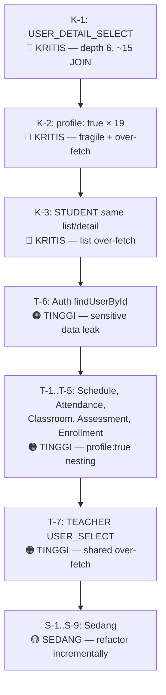

# 🔍 Prisma Repository Audit Report

**Scope**: Seluruh `*.includes.ts` dan `*repository.ts` di `backend/src/`
**Tanggal**: 12 Agustus 2026
**Fokus**: Fat query / over-fetching, Fragile include, Cross-module coupling

---

## Ringkasan Temuan

| Kategori | Kritis | Tinggi | Sedang |
|---|---|---|---|
| **Fat Query / Over-fetching** | 1 | 4 | 5 |
| **Fragile Include** | 2 | 6 | 11 |
| **Cross-module Coupling** | 2 | 3 | 2 |

---

## 🔴 KRITIS — Perbaiki Segera

---

### K-1. `USER_DETAIL_SELECT` — Monster Query 6 Level Deep

> [!CAUTION]
> Query terdalam di seluruh codebase. Satu endpoint memicu JOIN ke ~15 tabel. Crash risk tinggi setiap ada migrasi di tabel mana pun.

**File**: [prisma-profile.includes.ts](file:///d:/Project/241-Apps/backend/src/platform/profile/infrastructure/persistence/prisma-profile.includes.ts#L23-L105)
**Digunakan di**: [prisma-profile.repository.ts](file:///d:/Project/241-Apps/backend/src/platform/profile/infrastructure/persistence/prisma-profile.repository.ts#L28-L33) → `findDetailByUserId()`

**Pohon relasi (depth)**:
```
User (root)
├─ userRoles → role → rolePermissions → permission          (depth 4)
├─ profile → PROFILE_INCLUDE                                 (depth 2)
│   ├─ socialMedias → socialMedia                            (depth 3)
│   ├─ achievements → type                                   (depth 3)
│   ├─ scholarships                                          (depth 2)
│   ├─ educationalHistories                                  (depth 2)
│   ├─ religion                                              (depth 2)
│   ├─ bloodType                                             (depth 2)
│   └─ avatarFile                                            (depth 2)
├─ teacher                                                   (depth 1, FULL include)
│   ├─ addresses                                             (depth 2)
│   ├─ employmentType                                        (depth 2)
│   ├─ teacherPositions → position → category                (depth 4)
│   └─ teachingAssignments → subject                         (depth 3)  ⚠️ FRAGILE
├─ student                                                   (depth 1, FULL include)
│   ├─ addresses                                             (depth 2)
│   ├─ enrollments → classroom → grade                       (depth 4)
│   │   ├─ → classroom → classroomSupervisors → teacher      (depth 5)
│   │   │      → user → profile                              (depth 6) ⚠️ DEEPEST
│   │   └─ → semester → academicYear                         (depth 4)
│   └─ parents → parent → occupation, education, addresses   (depth 4)
```

**Masalah**:
1. **Fat Query**: Depth 6 levels. ~15 tabel di-JOIN dalam satu query. List endpoint mendapat data teacher DAN student walaupun user hanya salah satu.
2. **Fragile Include**: `teachingAssignments` di-include dengan `subject: true` — kalau ada kolom baru di `TeachingAssignment` yang belum dimigrasi, crash. Ini persis bug yang pernah terjadi.
3. **Cross-module Coupling**: Repository di modul `platform/profile` me-resolve data dari `academic/teacher`, `academic/student`, `academic/enrollment`, `academic/classroom`, dan `academic/parent` secara dalam. Membangun dependency tree satu arah seharusnya: profile → academic, bukan profile mencaplok seluruh domain academic.

**Rekomendasi**:
- Pecah menjadi 2-3 query terpisah: (1) user + profile + roles, (2) teacher detail (jika role=teacher), (3) student detail (jika role=student)
- Ganti `profile: true` di user→teacher→user→profile (depth 6) dengan `select: { name: true }`
- `teachingAssignments` gunakan `select` spesifik, bukan `include` penuh
- Academic data seharusnya di-fetch via modul academic sendiri, bukan nested include dari profile

---

### K-2. `profile: true` Digunakan Massal Sebagai Include Penuh (19 Lokasi)

> [!CAUTION]
> `profile: true` menarik SEMUA 15+ kolom Profile (NIK, email, phone, birthDate, NPWP, dll) di 19 tempat berbeda. Hampir semua hanya butuh `name`. Ini over-fetch dan fragile — kolom baru di Profile langsung terbawa ke 19 endpoint.

**Lokasi**: (diurutkan berdasar depth / risiko)

| # | File | Depth `profile: true` | Butuh apa? |
|---|---|---|---|
| 1 | [prisma-profile.includes.ts L78](file:///d:/Project/241-Apps/backend/src/platform/profile/infrastructure/persistence/prisma-profile.includes.ts#L78) | 6 (supervisor→teacher→user→profile) | `name` saja |
| 2 | [prisma-auth.repository.ts L32](file:///d:/Project/241-Apps/backend/src/platform/auth/infrastructure/persistence/prisma-auth.repository.ts#L32) | 2 (user→profile) | `name` + `avatarFileId` |
| 3 | [prisma-teacher.includes.ts L9](file:///d:/Project/241-Apps/backend/src/academic/teacher/infrastructure/persistence/prisma-teacher.includes.ts#L9) | 2 (teacher→user.profile) | `name` saja |
| 4 | [prisma-student.includes.ts L11](file:///d:/Project/241-Apps/backend/src/academic/student/infrastructure/persistence/prisma-student.includes.ts#L11) | 2 (student→user.profile) | `name` saja |
| 5 | [prisma-enrollment.includes.ts L8](file:///d:/Project/241-Apps/backend/src/academic/enrollment/infrastructure/persistence/prisma-enrollment.includes.ts#L8) | 3 (enrollment→student→user→profile) | `name` saja |
| 6 | [prisma-schedule.includes.ts L11](file:///d:/Project/241-Apps/backend/src/academic/schedule/infrastructure/persistence/prisma-schedule.includes.ts#L11) | 4 (schedule→TA→teacher→user→profile) | `name` saja |
| 7 | [prisma-teaching-assignment.includes.ts L8](file:///d:/Project/241-Apps/backend/src/academic/teaching-assignment/infrastructure/persistence/prisma-teaching-assignment.includes.ts#L8) | 3 (TA→teacher→user→profile) | `name` saja |
| 8 | [prisma-assessment.includes.ts L12](file:///d:/Project/241-Apps/backend/src/academic/assessment/infrastructure/persistence/prisma-assessment.includes.ts#L12) | 4 (item→TA→teacher→user→profile) | `name` saja |
| 9 | [prisma-assessment.includes.ts L37](file:///d:/Project/241-Apps/backend/src/academic/assessment/infrastructure/persistence/prisma-assessment.includes.ts#L37) | 4 (score→enrollment→student→user→profile) | `name` saja |
| 10 | [prisma-classroom.includes.ts L24](file:///d:/Project/241-Apps/backend/src/academic/classroom/infrastructure/persistence/prisma-classroom.includes.ts#L24) | 3 (supervisor→teacher→user→profile) | `name` saja |
| 11 | [prisma-classroom.includes.ts L46,55,64,73](file:///d:/Project/241-Apps/backend/src/academic/classroom/infrastructure/persistence/prisma-classroom.includes.ts#L42-L77) | 3 (structure→student→user→profile) | `name` saja (×4 roles) |
| 12 | [prisma-report-card.includes.ts L10](file:///d:/Project/241-Apps/backend/src/academic/report-card/infrastructure/persistence/prisma-report-card.includes.ts#L10) | 4 (reportCard→enrollment→student→user→profile) | `name` saja |
| 13 | [prisma-graduation.includes.ts L8](file:///d:/Project/241-Apps/backend/src/academic/graduation/infrastructure/persistence/prisma-graduation.includes.ts#L8) | 3 (graduation→student→user→profile) | `name` saja |
| 14 | [prisma-attendance.includes.ts L20](file:///d:/Project/241-Apps/backend/src/academic/attendance/infrastructure/persistence/prisma-attendance.includes.ts#L20) | 4 (attendance→enrollment→student→user→profile) | `name` saja |
| 15 | [prisma-admission.includes.ts L19](file:///d:/Project/241-Apps/backend/src/admission/infrastructure/persistence/prisma-admission.includes.ts#L19) | 2 (application→user→profile) | `name` + fields admission |

**Rekomendasi**:
- Buat shared select constant: `PROFILE_NAME_SELECT = { select: { name: true } }` atau `PROFILE_DISPLAY_SELECT = { select: { name: true, avatarFileId: true } }`
- Ganti semua 19 `profile: true` → `profile: PROFILE_NAME_SELECT` (atau variant yang sesuai)
- Ini secara dramatis mengurangi data transfer dan menghilangkan fragility

---

### K-3. `STUDENT_INCLUDE` — List dan Detail Identik

> [!WARNING]
> `STUDENT_LIST_INCLUDE` dan `STUDENT_DETAIL_INCLUDE` merujuk ke objek yang sama persis. List page mendapat `enrollments` dengan `classroom: true` + `semester → academicYear` untuk SETIAP siswa dalam satu halaman.

**File**: [prisma-student.includes.ts](file:///d:/Project/241-Apps/backend/src/academic/student/infrastructure/persistence/prisma-student.includes.ts#L25-L26)

```typescript
export const STUDENT_LIST_INCLUDE = STUDENT_INCLUDE;
export const STUDENT_DETAIL_INCLUDE = STUDENT_INCLUDE;
```

**Masalah**:
1. **Fat Query**: List page pull semua enrollments per student. Halaman list 10 siswa = 10 × (all enrollments × classroom × semester × academicYear). Bisa puluhan row unnecessary.
2. **Fragile**: `classroom: true` di enrollment include seluruh kolom Classroom (capacity, isActive, deletedAt, plus 6 relation back-references).
3. `grade: true` di root Student include seluruh Grade model.
4. `profile: true` menarik semua kolom (lihat K-2).

**Rekomendasi**:
- Pisahkan `STUDENT_LIST_INCLUDE` — hanya perlu `user.profile.name`, `grade.name`, dan mungkin enrollment aktif saja
- `STUDENT_DETAIL_INCLUDE` bisa tetap lebih lengkap, tapi `classroom: true` ganti dengan select `{ id, name, code, grade: { select: { name: true } } }`

---

## 🟠 TINGGI — Potensi Masalah Nyata

---

### T-1. `SCHEDULE_WITH_DETAILS_INCLUDE` — 4 Level Deep, Full Profile

**File**: [prisma-schedule.includes.ts](file:///d:/Project/241-Apps/backend/src/academic/schedule/infrastructure/persistence/prisma-schedule.includes.ts#L3-L20)

```
Schedule
└─ teachingAssignment                      (include penuh)
   ├─ teacher                              (include penuh)
   │   └─ user                             (include penuh)
   │       └─ profile: true                (depth 4, SEMUA kolom)
   ├─ subject: true                        (include penuh)
   └─ classroom: true                      (include penuh)
```

**Masalah**:
- `teacher: { include: { user: { include: { profile: true } } } }` — over-fetch. Schedule view hanya butuh nama guru, bukan NIK, tanggal lahir, dll.
- `classroom: true` dan `subject: true` — include penuh, padahal schedule hanya butuh nama dan kode.
- TeachingAssignment di-include penuh, termasuk kolom-kolom yang mungkin tidak relevan.

**Rekomendasi**: Ganti semua `true` dengan select spesifik. Schedule hanya butuh: `teacher.user.profile.name`, `subject.name`, `classroom.name/code`, `timeSlot.startTime/endTime/type.name`.

---

### T-2. `ATTENDANCE_WITH_DETAILS_INCLUDE` — 4 Level + Double Cross-Module

**File**: [prisma-attendance.includes.ts](file:///d:/Project/241-Apps/backend/src/academic/attendance/infrastructure/persistence/prisma-attendance.includes.ts#L3-L27)

```
Attendance
├─ schedule → teachingAssignment → subject, classroom        (depth 3)
└─ enrollment → student → user → profile: true              (depth 4)
```

**Masalah**:
- Depth 4, `profile: true` over-fetch.
- `subject: true` dan `classroom: true` include penuh — hanya butuh nama.
- Query ini dijalankan per-record attendance, sehingga pada bulk listing bisa sangat berat.

**Rekomendasi**: Ganti `profile: true` → `{ select: { name: true } }`, dan `subject/classroom: true` → select nama saja.

---

### T-3. `CLASSROOM_STRUCTURE_INCLUDE` — 4× `profile: true` Berulang

**File**: [prisma-classroom.includes.ts](file:///d:/Project/241-Apps/backend/src/academic/classroom/infrastructure/persistence/prisma-classroom.includes.ts#L39-L78)

```
ClassroomStructure
├─ classroom: true                         (include penuh)
├─ semester → academicYear                 (depth 2)
├─ president → user → profile: true        (depth 3, FULL)
├─ vicePresident → user → profile: true    (depth 3, FULL)
├─ secretary → user → profile: true        (depth 3, FULL)
└─ treasurer → user → profile: true        (depth 3, FULL)
```

**Masalah**:
- Pola `user: { include: { profile: true } }` DIULANGI 4 kali. Masing-masing menarik semua 15+ kolom Profile untuk keempat student officer.
- `classroom: true` include penuh, tapi di context ini kita sudah tahu classroom-nya.
- Cross-module: mengakses Student model (milik academic/student) dan User/Profile (milik platform).

**Rekomendasi**: Buat reusable fragment `STUDENT_NAME_INCLUDE = { user: { select: { profile: { select: { name: true } } } } }` dan gunakan untuk keempat role.

---

### T-4. `ASSESSMENT_ITEM_WITH_DETAILS_INCLUDE` — 4 Level untuk Teacher Name

**File**: [prisma-assessment.includes.ts](file:///d:/Project/241-Apps/backend/src/academic/assessment/infrastructure/persistence/prisma-assessment.includes.ts#L3-L24)

```
AssessmentItem
└─ teachingAssignment (include penuh)
   ├─ subject: true                        (include penuh)
   ├─ classroom: true                      (include penuh)
   └─ teacher (include penuh)
       └─ user (include penuh)
           └─ profile: true               (depth 4, ALL COLUMNS)
```

**Masalah**:
- TeachingAssignment di-include penuh hanya untuk mendapat nama guru, nama mapel, dan nama kelas.
- `profile: true` di depth 4.
- `classroom: true` menarik seluruh Classroom model termasuk capacity, back-references, dll.

**Rekomendasi**: Select hanya fields yang dibutuhkan di setiap level.

---

### T-5. `ENROLLMENT_WITH_DETAILS_INCLUDE` — `profile: true` via Cross-Module

**File**: [prisma-enrollment.includes.ts](file:///d:/Project/241-Apps/backend/src/academic/enrollment/infrastructure/persistence/prisma-enrollment.includes.ts#L3-L17)

```
StudentEnrollment
├─ student → user → profile: true          (depth 3, FULL)
├─ classroom → grade: true                 (depth 2, include penuh)
└─ semester → academicYear: true           (depth 2, include penuh)
```

**Masalah**:
- `profile: true` over-fetch — hanya butuh nama.
- `user: { include: { profile: true } }` bukan `user: { select: { ... } }` — semua kolom User juga terbawa (passwordHash, lastLoginAt, dll!)
- `grade: true` include penuh.

**Rekomendasi**: `user: { select: { profile: { select: { name: true } } } }`, dan grade hanya `{ select: { name: true, level: true } }`.

---

### T-6. `AUTH findUserById` — 4 Level Include, Full Permission Tree

**File**: [prisma-auth.repository.ts](file:///d:/Project/241-Apps/backend/src/platform/auth/infrastructure/persistence/prisma-auth.repository.ts#L28-L42)

```
User
├─ profile: true                                             (FULL, depth 1)
└─ userRoles → role → rolePermissions → permission          (depth 4)
```

**Masalah**:
- `profile: true` menarik SEMUA kolom Profile (NIK, birthDate, NPWP, dll) untuk endpoint `GET /auth/me`. Session bootstrap TIDAK perlu data sensitif ini.
- 4 level deep untuk permission tree (acceptable, tapi bisa di-cache).

**Rekomendasi**: Ganti `profile: true` → `profile: { select: { name: true, avatarFileId: true } }`. Data sensitif profile tidak perlu dikirim ke frontend saat session bootstrap.

---

### T-7. `TEACHER_LIST_INCLUDE` — `USER_SELECT` includes `profile: true`

**File**: [prisma-teacher.includes.ts](file:///d:/Project/241-Apps/backend/src/academic/teacher/infrastructure/persistence/prisma-teacher.includes.ts#L3-L19)

```typescript
export const USER_SELECT = {
  id: true,
  identifier: true,
  isActive: true,
  createdAt: true,
  updatedAt: true,
  profile: true,       // ⚠️ SEMUA kolom Profile
} as const;
```

**Masalah**:
- `USER_SELECT` digunakan oleh KEDUA `TEACHER_LIST_INCLUDE` dan `TEACHER_DETAIL_INCLUDE`.
- `profile: true` membawa semua kolom. Pada list page (banyak teacher), ini over-fetch signifikan.
- `createdAt` dan `updatedAt` di User level biasanya tidak ditampilkan di teacher list.

**Rekomendasi**: Buat `USER_LIST_SELECT` (hanya `id, identifier, profile: { select: { name: true } }`) dan `USER_DETAIL_SELECT` (lebih lengkap) yang terpisah.

---

## 🟡 SEDANG — Perbaiki Saat Refactor

---

### S-1. `SUPERVISOR_WITH_DETAILS_INCLUDE` — `profile: true` nested

**File**: [prisma-classroom.includes.ts](file:///d:/Project/241-Apps/backend/src/academic/classroom/infrastructure/persistence/prisma-classroom.includes.ts#L18-L30)

```
Supervisor → teacher → user → profile: true (depth 3)
```

Hanya butuh nama guru. Ganti `profile: true` → `{ select: { name: true } }`.

---

### S-2. `TEACHING_ASSIGNMENT_WITH_DETAILS_INCLUDE` — Multiple full includes

**File**: [prisma-teaching-assignment.includes.ts](file:///d:/Project/241-Apps/backend/src/academic/teaching-assignment/infrastructure/persistence/prisma-teaching-assignment.includes.ts#L3-L20)

```
TeachingAssignment
├─ teacher → user → profile: true          (depth 3, FULL)
├─ subject: true                           (include penuh)
├─ classroom: true                         (include penuh)
├─ semester → academicYear: true           (depth 2)
└─ schedules → timeSlot → type: true       (depth 3)
```

Over-fetch di profile dan redundant data di `classroom: true`/`subject: true`.

---

### S-3. `REPORT_CARD_WITH_DETAILS_INCLUDE` — 4 Level, `profile: true`

**File**: [prisma-report-card.includes.ts](file:///d:/Project/241-Apps/backend/src/academic/report-card/infrastructure/persistence/prisma-report-card.includes.ts#L3-L21)

```
ReportCard → enrollment → student → user → profile: true (depth 4)
```

Report card butuh nama siswa — bukan NIK, email, NPWP, dll.

---

### S-4. `GRADUATION_WITH_DETAILS_INCLUDE` — `profile: true` at depth 3

**File**: [prisma-graduation.includes.ts](file:///d:/Project/241-Apps/backend/src/academic/graduation/infrastructure/persistence/prisma-graduation.includes.ts#L3-L14)

```
Graduation → student → user → profile: true (depth 3)
```

Graduation view butuh nama dan NIS. Ganti `user → profile: true` dengan select spesifik.

---

### S-5. `APPLICATION_WITH_DETAILS_INCLUDE` — `user → profile: true`

**File**: [prisma-admission.includes.ts](file:///d:/Project/241-Apps/backend/src/admission/infrastructure/persistence/prisma-admission.includes.ts#L16-L29)

```
AdmissionApplication
├─ user → profile: true                    (FULL include, all columns)
├─ wave → academicYear: true              (include penuh)
└─ parents → occupation, education         (include penuh, tapi acceptable)
```

`profile: true` bawa semua data. Application context mungkin butuh lebih banyak, tapi tetap bisa di-select.

---

### S-6. `LOAN_WITH_DETAILS_INCLUDE` — Unit Full Include Chain

**File**: [prisma-circulation.includes.ts](file:///d:/Project/241-Apps/backend/src/inventory/circulation/infrastructure/persistence/prisma-circulation.includes.ts#L3-L16)

```
Loan → items → unit → asset: true, location: true, status: true, condition: true
```

`asset: true` di depth 3 menarik seluruh kolom InventoryAsset (description, acquisitionDate, dll). Untuk loan view, biasanya hanya butuh `asset.name` dan `asset.code`.

---

### S-7. `ASSET_WITH_DETAILS_INCLUDE` — Bare includes

**File**: [prisma-asset.includes.ts](file:///d:/Project/241-Apps/backend/src/inventory/asset/infrastructure/persistence/prisma-asset.includes.ts#L3-L19)

```
Asset
├─ category: true
├─ fundingSource: true
└─ units → condition: true, status: true, location: true
```

`category: true`, `fundingSource: true` include semua kolom. Biasanya hanya butuh `name`. Units include chain bisa berat pada aset dengan banyak unit.

---

### S-8. `CALENDAR_WITH_DETAILS_INCLUDE` — Triple `true`

**File**: [prisma-calendar.includes.ts](file:///d:/Project/241-Apps/backend/src/academic/calendar/infrastructure/persistence/prisma-calendar.includes.ts#L3-L7)

```typescript
academicYear: true,    // include penuh
semester: true,        // include penuh
type: true,            // include penuh
```

Tiga `true` sekaligus. Calendar list hanya butuh nama dari masing-masing. `semester: true` menarik semua kolom termasuk back-references.

---

### S-9. `GRADE_ACADEMIC_YEAR_INCLUDE` — Triple bare include

**File**: [prisma-grade-academic-year.includes.ts](file:///d:/Project/241-Apps/backend/src/academic/grade/infrastructure/persistence/prisma-grade-academic-year.includes.ts#L3-L7)

```typescript
grade: true,           // include penuh
academicYear: true,    // include penuh
curricula: true,       // include penuh — SELURUH curricula rows
```

`curricula: true` menarik SEMUA kolom dan rows dari curricula tanpa filter `deletedAt`. Fragile dan over-fetch.

---

## 🔵 Cross-Module Coupling Details

---

### C-1. `platform/profile` → Seluruh `academic/*`  (KRITIS)

**File**: [prisma-profile.includes.ts — USER_DETAIL_SELECT](file:///d:/Project/241-Apps/backend/src/platform/profile/infrastructure/persistence/prisma-profile.includes.ts#L23-L105)

`platform/profile` repository me-resolve:
- `academic/teacher` → addresses, employmentType, teacherPositions → position → category, teachingAssignments → subject
- `academic/student` → addresses, enrollments → classroom → grade → classroomSupervisors → teacher → user → profile
- `academic/parent` → parent → occupation, education, addresses
- `academic/enrollment` → classroom, semester → academicYear

**Seharusnya**: Profile module hanya tahu bahwa user punya teacher/student role. Detail teacher/student di-fetch oleh modul academic sendiri melalui dedicated endpoint.

---

### C-2. `platform/dashboard` → Hampir semua modul  (TINGGI)

**File**: [prisma-dashboard.repository.ts](file:///d:/Project/241-Apps/backend/src/platform/dashboard/infrastructure/persistence/prisma-dashboard.repository.ts)

Dashboard repository langsung query:
- `academic/student` (StudentEnrollment, Student)
- `academic/teacher` (Teacher, TeacherPosition)
- `academic/classroom` (Classroom)
- `academic/subject` (Subject)
- `academic/calendar` (AcademicCalendar)
- `academic/attendance` (Attendance)
- `platform/announcement` (Announcement)
- `admission` (AdmissionApplication)

> [!NOTE]
> Dashboard coupling bisa dianggap acceptable karena sifatnya read-only aggregation. Namun, jika modul academic berubah schema-nya, dashboard ikut terdampak. Idealnya, setiap modul menyediakan "stats port" yang di-consume dashboard.

---

### C-3. `academic/schedule` → `academic/teaching-assignment` → `academic/teacher` → `platform/user` → `platform/profile`  (TINGGI)

**File**: [prisma-schedule.includes.ts](file:///d:/Project/241-Apps/backend/src/academic/schedule/infrastructure/persistence/prisma-schedule.includes.ts)

Schedule include menembus 4 module boundary:
`schedule` → `teaching-assignment` → `teacher` → `user` (platform) → `profile` (platform)

Ini wajar secara domain, tapi implementasinya menggunakan `include: true` di setiap level sehingga menarik lebih dari yang diperlukan.

---

### C-4. `academic/attendance` → `academic/schedule` + `academic/enrollment` → `platform/*`

**File**: [prisma-attendance.includes.ts](file:///d:/Project/241-Apps/backend/src/academic/attendance/infrastructure/persistence/prisma-attendance.includes.ts)

Attendance menarik data dari 2 cabang berbeda, masing-masing menembus ke platform (user/profile).

---

### C-5. `presence/credential` dan `presence/leave` → `platform/user` + `platform/profile`  (RENDAH ✅)

**File**: [prisma-credential.includes.ts](file:///d:/Project/241-Apps/backend/src/presence/credential/infrastructure/persistence/prisma-credential.includes.ts) | [prisma-leave.includes.ts](file:///d:/Project/241-Apps/backend/src/presence/leave/infrastructure/persistence/prisma-leave.includes.ts)

> [!TIP]
> Ini adalah **contoh yang BAIK**. Keduanya menggunakan `select` spesifik alih-alih `include: true`, sehingga hanya menarik `id`, `name`, `avatarFileId` yang benar-benar dibutuhkan. Coupling minimal dan terkontrol.

---

## 📊 Positif — Pola yang Sudah Benar

Beberapa repository sudah mengikuti best practice:

| File | Pattern | Catatan |
|---|---|---|
| [prisma-credential.includes.ts](file:///d:/Project/241-Apps/backend/src/presence/credential/infrastructure/persistence/prisma-credential.includes.ts) | `user: { select: { id, identifier, profile: { select: { name, avatarFileId } } } }` | ✅ Pinned shape, select spesifik |
| [prisma-leave.includes.ts](file:///d:/Project/241-Apps/backend/src/presence/leave/infrastructure/persistence/prisma-leave.includes.ts) | `requester: { select: { id, profile: { select: { name } } } }` | ✅ Minimal, ada mapper |
| [post.includes.ts](file:///d:/Project/241-Apps/backend/src/portal/post/infrastructure/persistence/post.includes.ts) | `author: { select: { id, identifier, profile: { select: { name } } } }` | ✅ Select spesifik, documented |
| [payroll-run.where.ts](file:///d:/Project/241-Apps/backend/src/payroll/run/infrastructure/persistence/payroll-run.where.ts) | `ACTOR_SELECT`, `payslips: { select: { grossAmount, deductionAmount, netAmount } }` | ✅ Minimal shape |
| [prisma-payslip.repository.ts](file:///d:/Project/241-Apps/backend/src/payroll/payslip/infrastructure/persistence/prisma-payslip.repository.ts) | `EMPLOYEE_SELECT`, `DETAIL_INCLUDE` dengan select eksplisit | ✅ Exemplary |
| [prisma-promotion.includes.ts](file:///d:/Project/241-Apps/backend/src/academic/semester/infrastructure/persistence/prisma-promotion.includes.ts) | `ACTIVE_ENROLLMENT_WITH_DETAILS_SELECT` dengan full select tree | ✅ Every field pinned |
| [prisma-subject.includes.ts](file:///d:/Project/241-Apps/backend/src/academic/subject/infrastructure/persistence/prisma-subject.includes.ts) | `TEACHING_ASSIGNMENT_SELECT` dengan dynamic where | ✅ Documented, semester-scoped |
| [prisma-dashboard.repository.ts](file:///d:/Project/241-Apps/backend/src/platform/dashboard/infrastructure/persistence/prisma-dashboard.repository.ts) | Inline `select` di setiap query | ✅ No global constants, tapi selects eksplisit |

---

## 🎯 Prioritas Perbaikan



### Quick Win: Buat Shared Profile Selects

Satu perubahan ini memperbaiki K-2 dan banyak issue T-*/S-*:

```typescript
// shared/prisma-fragments.ts
export const PROFILE_NAME_SELECT = { select: { name: true } } as const;
export const PROFILE_DISPLAY_SELECT = { select: { name: true, avatarFileId: true } } as const;

// Contoh penggunaan:
export const SCHEDULE_WITH_DETAILS_INCLUDE = {
  teachingAssignment: {
    select: {
      teacher: {
        select: {
          user: { select: { profile: PROFILE_NAME_SELECT } },
        },
      },
      subject: { select: { name: true } },
      classroom: { select: { name: true, code: true } },
    },
  },
  timeSlot: { select: { startTime: true, endTime: true, type: { select: { name: true } } } },
};
```

---

> [!IMPORTANT]
> **Jangan fix sekarang.** Laporan ini adalah baseline untuk prioritisasi. Mulai dari K-1 (pecah `USER_DETAIL_SELECT`) dan K-2 (ganti `profile: true` massal) karena keduanya memiliki blast radius terbesar dan paling berisiko crash saat migrasi berikutnya.
